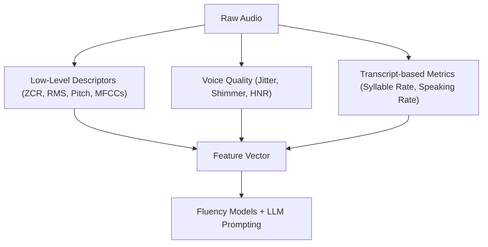

# Feature Engineering (Audio)

Feature engineering transforms raw audio signals into structured numerical representations that can be fed into ML models.  
TruthSense combines low-level acoustic descriptors with high-order prosodic and linguistic metrics to capture both signal quality and speech delivery traits.

---

## Inputs
- Raw audio waveform (buffer or file)  
- Transcript (for linguistic-derived metrics, e.g., syllable rate)  

---

## Extracted Features

### 1. Low-Level Descriptors
- **Zero Crossing Rate (ZCR)** – estimates noisiness.  
- **Root Mean Square (RMS) Energy** – intensity of speech.  
- **Pitch Contour (F0)** – fundamental frequency trajectory.  
- **MFCCs (Mel-Frequency Cepstral Coefficients)** – timbre and articulation.  
- **Delta MFCCs** – rate of change in MFCCs over time.  

### 2. Prosodic & Voice Quality Metrics
- **Speaking Rate** – words per second, from transcript + duration.  
- **Syllable Rate** – syllable count via CMUdict, normalized by duration.  
- **Pauses / Silence Ratio** – duration of non-speech segments.  
- **Jitter** – cycle-to-cycle pitch variation (voice stability).  
- **Shimmer** – cycle-to-cycle amplitude variation.  
- **HNR (Harmonics-to-Noise Ratio)** – voice clarity measure.  

### 3. Derived Metrics
- **Fluency Markers** – filler detection, disfluency rate.  
- **Energy Variability** – standard deviation of RMS values.  
- **Pitch Range** – min–max span of F0 across utterance.  

---

## Implementation Notes
- **Library usage**:  
  - `librosa` / `soundfile` → decoding & spectral features.  
  - `parselmouth` (Praat bindings) → jitter, shimmer, HNR.  
  - `nltk` + `cmudict` → syllable count.  
- **Minimum duration**: audio shorter than 160 frames is discarded.  
- **Normalization**: features are z-scored before being passed into ML models.  
- **Async handling**: runs within the broader audio pipeline (`extract_features`).  

---

## Downstream Usage
- **Fluency Models** → classifier/regressor on delivery traits.  
- **LLM Prompting** → key metrics are included in structured prompts.  
- **Frontend Feedback** → visualizations of pitch, pauses, energy.  

---

## Visual Overview

 
---