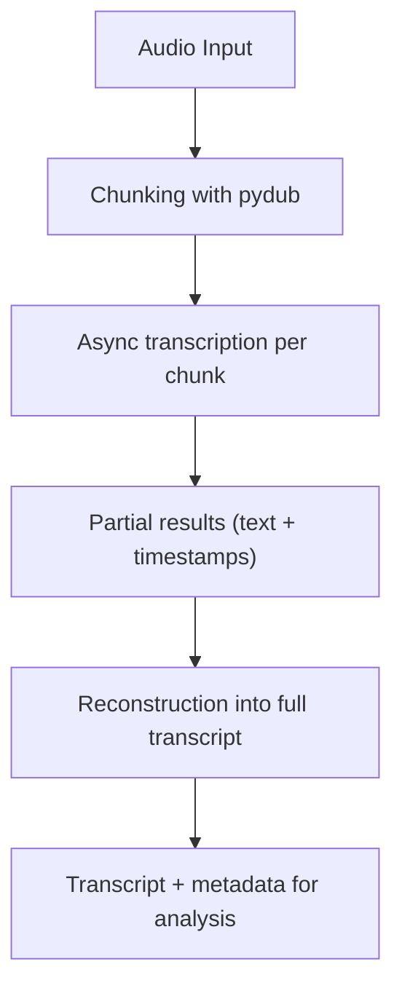

# Audio Transcription

The transcription module in TruthSense converts raw audio into structured text.  
This transcript is essential not only for content analysis but also for downstream features such as **speaking rate**, **syllable estimation**, and **pause detection**.

---

## Workflow

1. **Chunking**  
   - Audio is first loaded using `pydub.AudioSegment`.  
   - Long recordings are split into smaller segments (default: 30–60 seconds) to stay within transcription model limits.  
   - Each chunk is normalized and exported to a temporary buffer.

2. **Async Dispatch**  
   - All chunks are dispatched to the transcription backend concurrently using Python’s `asyncio.gather`.  
   - This allows parallel inference and significantly reduces processing time for long files.

3. **Transcription Model**  
   - TruthSense uses an **ASR engine** (e.g., OpenAI Whisper or a fine-tuned model).  
   - Each chunk returns partial transcripts with timestamps.

4. **Reconstruction**  
   - Partial transcripts are collated in chronological order.  
   - Metadata such as timestamps, confidence scores, and word counts are stored alongside the raw text.  
   - The final transcript is a continuous string plus a structured object for downstream use.

---

## Core Function: `transcribe_audio`

```python
async def transcribe_audio(audio_path, client):
    # 1. Split audio into chunks
    chunks = split_audio_with_pydub(audio_path)

    # 2. Run concurrent transcription tasks
    tasks = [client.transcribe(chunk) for chunk in chunks]
    results = await asyncio.gather(*tasks)

    # 3. Merge results into a unified transcript
    transcript = "".join([r.text for r in results])
    return {
        "transcript": transcript,
        "chunks": results
    }
```

### Inputs
- Raw audio file or buffer  
- Transcription client (e.g., Whisper API)  

---

### Outputs
- Continuous transcript string  
- Structured list of chunk results (timestamps, text, confidences)  

---

## Downstream Usage

The transcript is not just text — it feeds directly into other modules:

- **Fluency Analysis**  
  Words per second are computed from transcript length and clip duration.  

- **Syllable Rate Estimation**  
  The transcript is tokenized and matched against the CMU Pronouncing Dictionary.  

- **Pause Detection**  
  Long silences are aligned against transcript word timings to identify hesitation.  

---

## End-to-End Behavior

- Large audio files are seamlessly chunked, transcribed, and reassembled.  
- Short recordings bypass chunking and are transcribed in a single pass.  
- Every transcript object includes both plain text and structured metadata for flexible downstream use.  

---

## Visual Overview



---