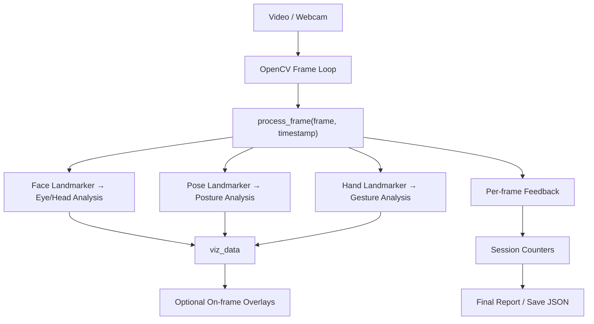

# Video Analysis – Overview

All video analysis in TruthSense is encapsulated in a single class: **`BodyLanguageCorrector`** (`video/posture.py`).  
It orchestrates **face/eye**, **pose**, and **hand** landmark detection using MediaPipe Tasks, performs per-frame analysis, shows **live visualizations**, and prints/saves a **session report**.

> **Models required** (bundled in your repo):  
> `posenet_models/pose_landmarker.task`  
> `posenet_models/face_landmarker.task`  
> `posenet_models/hand_landmarker.task`  
> Paths are resolved relative to `posture.py`. Update them if you move files.

---

## What it measures

- **Eye contact & head pose**
  - Auto-calibrated **gaze reference** on the first frame.
  - **Iris-in-circle** check per eye + **gaze-vector alignment** with the calibrated mean.
  - **Blink detection** via Eye Aspect Ratio (EAR).
- **Posture**
  - **Shoulder alignment** (tilt).
  - **Head vs body alignment** (nose vs shoulder midpoint).
- **Gestures**
  - Hands present / not present.
  - Hand height (high / mid / low) for one/both hands.

---

## Class at a glance

```python
# video/posture.py
class BodyLanguageCorrector:
    def __init__(self):
        # Loads task files from ../../posenet_models/
        # Creates PoseLandmarker, HandLandmarker, FaceLandmarker (RunningMode.VIDEO)
        # Sets blink/iris/gaze constants & initializes counters/state

    def run_video_analysis(self, video_source=0, show_viz=True, display=True, save_location=""):
        # OpenCV loop -> process_frame() each frame
        # Optional on-frame overlays + end-of-session report/save

    def process_frame(self, frame, timestamp_ms):
        # Pose + Hand + Eye/Head analysis
        # Returns: {"feedback": {...}, "viz_data": {...}}

    def eye_and_head_analysis(self, frame, timestamp):
        # Blink (EAR), iris-in-bounds, gaze vector alignment, auto-calibration
        # Packs visualization hints (circles, arrow) into viz_data

    def posture_analysis(self, pose_landmarks):
        # Shoulder tilt + head vs shoulder-center alignment

    def gesture_analysis(self, hand_landmarks_list):
        # Hands present & height categories

    def print_final_report(self):
        # Percentages across session per category + avg eye-contact confidence
```

## Quick start

```python
# Usage example (at bottom of posture.py)
from video.posture import BodyLanguageCorrector

corrector = BodyLanguageCorrector()
# webcam = 0, or pass a video file path
corrector.run_video_analysis(
    video_source=0,          # draw circles/arrow + on-frame text
    show_viz=False,          # visualization toggle
    display=True,            # print final report at the end
    save_location="hello.json"  # optional JSON in the same folder as posture.py
)
**Keyboard:** press `q` to quit.
```

---

## Runtime parameters (in `run_video_analysis`)

- **video_source** *(int | str)* — `0` for webcam or a video file path.  

- **show_viz** *(bool)* — draw iris circles and gaze arrow + on-frame text.  

- **display** *(bool)* — print the final session report to stdout at exit.  

- **save_location** *(str)* — filename (e.g., `report.json`). If omitted, nothing is saved.  
  - File is written next to `posture.py`. `.json` is appended if missing.  

---

## Auto-calibration (first frame)

On the first frame where a face is detected:
- The class captures a reference gaze vector (`_reference_mean`) from both eyes.  
- That vector becomes the baseline for gaze alignment checks.  
- The frame is treated as **perfect eye contact** for initialization, and a green arrow is drawn.  

---

## Constants & thresholds (from code)

- **Blink (EAR):** `EAR_THRESHOLD = 0.2`  
- **Iris circle radius:** derived from eyelid top/bottom with `RADIUS_MULTIPLIER = 0.2`  
  - Tip: on a 14″ laptop use `0.15`.  
- **Gaze alignment:** `THRESHOLD_COSINE = 0.9` (dot product threshold)  

These live in `__init__`, so you can tune them per device.  

---

## What process_frame returns
```python
{
  "feedback": {
    "eyeContact": {
      "<Eye contact maintained | Eyes off-center | Blinking | No face detected>": 1,
      "confidence": <float 0..1>   # running average across frames
    },
    "shoulderAlignment": { "<Good shoulder alignment | Slight shoulder tilt | Shoulders are tilted | No pose detected>": 1 },
    "headBodyAlignment": { "<Head aligned with body | Head slightly tilted | Head tilted | No pose detected>": 1 },
    "hands": { "<Hands not in frame | One hand ... | Both hands ...>": 1 }
  },
  "viz_data": {
    # set when a face is detected and not blinking
    "left_eye_center": (x, y) | None,
    "left_radius": float | None,
    "left_iris_pixel": (x, y) | None,
    "right_eye_center": (x, y) | None,
    "right_radius": float | None,
    "right_iris_pixel": (x, y) | None,
    "iris_center_combined": (x, y) | None,
    "gaze_endpoint": (x, y) | None,
    "gaze_color": (B, G, R) | None
  }
}
```
The feedback dict is per-frame. The class also maintains counters internally (self.feedback_counts) and prints percentages in the final report.

## Final report & saving

- Printed via `print_final_report()` automatically if `display=True`.  
- Saved to **JSON** (same folder as `posture.py`) if `save_location` is provided.  
- Includes: total frames, category counts, and average eye-contact confidence.  

---

## Visual Overview

